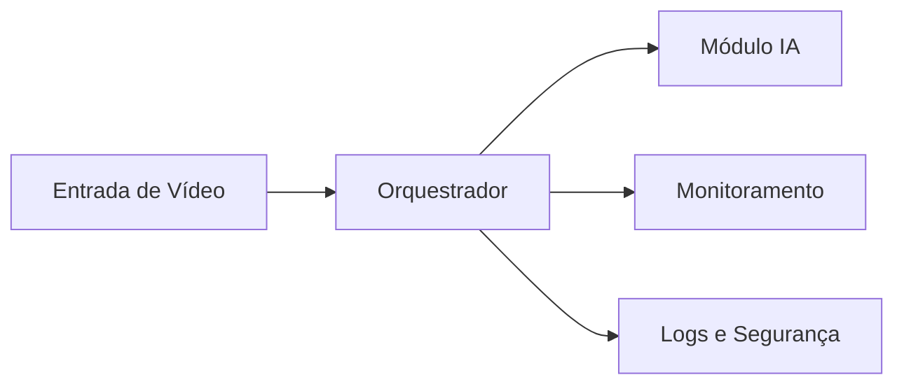

# Guia de Arquitetura Técnica

## Visão geral

O sistema é composto por múltiplos módulos orquestrados centralmente, com todos os serviços rodando em containers Docker para máxima modularidade, portabilidade e escalabilidade.

---

## Principais componentes

- **Orquestrador:** Gerencia a inicialização, monitoramento e reinicialização dos módulos.
- **Módulos/Plugins:** Cada módulo executa uma função específica, podendo ser plugado/desplugado conforme a necessidade.
- **Monitoramento (Prometheus/Grafana):** Coleta e apresenta métricas de desempenho e uso.
- **Segurança:** Autenticação (NGINX + JWT), gestão de segredos e logs detalhados.

---

## Fluxo simplificado

---

## Extensibilidade

- Novos módulos e plugins podem ser criados seguindo o padrão descrito em `13.6 🧩 Extensibilidade e Arquitetura de Plugins Módulos (Visão de Futuro).md`.
- Integrações via API REST e eventos são suportadas para acoplamento com sistemas externos.

---

## Referências

- [`VV-Video-AI-System-Master-Blueprint-v2.2.md`](VV-Video-AI-System-Master-Blueprint-v2.2.md)
- Seções 12.x e 13.x para detalhes avançados.

---